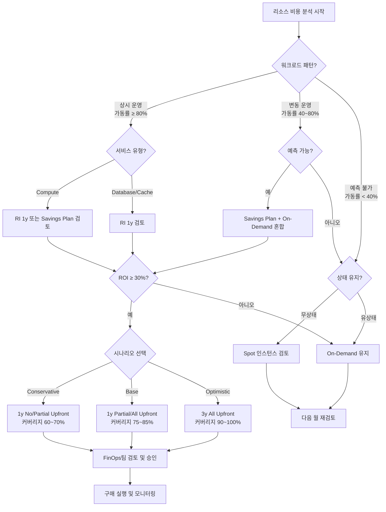

# RI / SP / Spot 의사결정 매트릭스

> 이 템플릿은 (주)하이브리지텔레콤(HBT) FinOps팀이 약정 할인 구매 전 사용하는 의사결정 가이드입니다.

---

## 1. 개요 및 사용법

### 목적

클라우드 리소스 특성(워크로드 패턴 × 서비스 유형)에 따라 최적의 구매 옵션(On-Demand / RI / Savings Plan / Spot)을 선택하기 위한 구조적 의사결정 프레임워크입니다.

### 사용 시점

- 신규 서비스 아키텍처 설계 시
- 월간 FinOps 리뷰에서 약정 기회 식별 시
- 분기별 예산 재검토 시

### 사용 방법

1. 대상 리소스의 **워크로드 패턴**을 식별합니다 (상시 / 변동 / 예측불가)
2. **서비스 유형**을 확인합니다 (Compute / Database / Cache)
3. 매트릭스에서 권장 옵션을 확인합니다
4. 시나리오를 선택하고 HBT 예시 계산을 참고하여 ROI를 검증합니다
5. 체크리스트를 통해 최종 구매 여부를 확정합니다

---

## 2. 리소스 유형별 의사결정 매트릭스

| 워크로드 패턴 | Compute (EC2/ECS) | Database (RDS) | Cache (ElastiCache) |
|--------------|-------------------|----------------|---------------------|
| **상시 운영** (24/7, 가동률 ≥ 80%) | RI 1y 또는 Savings Plan | RI 1y (Multi-AZ) | RI 1y |
| **변동 운영** (가동률 40~80%, 예측 가능) | Savings Plan + On-Demand 혼합 | RI 1y (최소 필요분) + On-Demand | RI 1y (최소 필요분) |
| **예측 불가** (가동률 < 40% 또는 불규칙) | Spot (무상태) / On-Demand (유상태) | On-Demand | On-Demand |

### 패턴 판별 기준

| 패턴 | 기준 | 판별 방법 |
|------|------|----------|
| 상시 운영 | 최근 4주 평균 가동률 ≥ 80% | AWS: CloudWatch CPUUtilization, EC2 인스턴스 상태 확인 |
| 변동 운영 | 평균 가동률 40~80%, 피크 예측 가능 | 주간/월간 트래픽 패턴 분석, 계절성 확인 |
| 예측 불가 | 평균 가동률 < 40% 또는 트래픽 패턴 불규칙 | 표준편차/평균 비율(CV) > 0.5 |

---

## 3. 시나리오 정의 및 적용 기준

### Conservative (보수적 시나리오)

- **적용 상황**: 서비스 런칭 초기, 트래픽 예측 불확실, 조직 내 FinOps 도입 초기
- **약정 비율**: On-Demand 사용량 대비 약정 커버리지 60~70%
- **약정 기간**: 1년 선호
- **지불 방식**: No Upfront 또는 Partial Upfront
- **기대 절감률**: 약 20~30%
- **리스크**: 낮음 (과도한 약정으로 인한 낭비 최소화)

### Base (기본 시나리오)

- **적용 상황**: 서비스 안정화 이후 6개월 이상 운영, 트래픽 패턴 확인 완료
- **약정 비율**: On-Demand 사용량 대비 약정 커버리지 75~85%
- **약정 기간**: 1년 기본, 3년은 핵심 안정 서비스만
- **지불 방식**: Partial Upfront
- **기대 절감률**: 약 30~40%
- **리스크**: 중간 (성장 가정이 틀릴 경우 일부 낭비 발생)

### Optimistic (낙관적 시나리오)

- **적용 상황**: 3년 이상 운영된 안정적 서비스, 트래픽 연간 성장률 < 10%
- **약정 비율**: On-Demand 사용량 대비 약정 커버리지 90~100%
- **약정 기간**: 3년 (All Upfront)
- **지불 방식**: All Upfront
- **기대 절감률**: 약 40~60%
- **리스크**: 높음 (서비스 축소/폐기 시 낭비 발생, 사전 비즈니스 검토 필수)

---

## 4. 약정 기간 × 지불 방식 조합 비교

> AWS RDS db.r6g.xlarge 기준 예시 (On-Demand: 월 ₩750,000 가정)

| 구분 | On-Demand | 1y No Upfront | 1y Partial Upfront | 1y All Upfront | 3y No Upfront | 3y Partial Upfront | 3y All Upfront |
|------|-----------|--------------|-------------------|----------------|--------------|-------------------|----------------|
| 월 비용 (KRW) | ₩750,000 | ₩562,500 | ₩525,000 | ₩510,000 | ₩450,000 | ₩412,500 | ₩375,000 |
| 절감률 | - | 25% | 30% | 32% | 40% | 45% | 50% |
| 선불 비용 | ₩0 | ₩0 | ₩3,150,000 | ₩6,120,000 | ₩0 | ₩7,425,000 | ₩13,500,000 |
| 유연성 | 최고 | 높음 | 중간 | 낮음 | 낮음 | 매우 낮음 | 없음 |
| 권장 시나리오 | 예측불가 | Conservative | Base | Base/Optimistic | Optimistic | Optimistic | Optimistic |

> 주의: 환율 ₩1,500/$1 적용. 실제 금액은 AWS 콘솔 또는 AWS Pricing Calculator에서 확인 필요.

---

## 5. HBT 예시 계산: RDS RI 도입 시나리오

### 대상 리소스

| 항목 | 내용 |
|------|------|
| 서비스 | Amazon RDS (Aurora MySQL) |
| 인스턴스 유형 | db.r6g.large × 3대 |
| 환경 | Production (Environment=prod) |
| 현재 월 비용 | ₩7,500,000 (On-Demand) |
| 운영 기간 | 24/7 상시 운영 |
| 가동률 | 평균 92% (최근 6개월) |

### 시나리오: 1y RI All Upfront 30% 절감

| 구분 | 내용 |
|------|------|
| 약정 옵션 | 1-Year Reserved Instance, All Upfront |
| 적용 인스턴스 | 3대 전체 |
| 할인율 | 30% |
| 월 절감액 | ₩7,500,000 × 30% = **₩2,250,000** |
| 연간 절감액 | ₩2,250,000 × 12 = **₩27,000,000** |
| 선불 비용 | ₩7,500,000 × 0.70 × 12 = **₩63,000,000** |
| ROI | ₩27,000,000 / ₩63,000,000 = **42.9%** |
| 손익분기점 | 약 8.4개월 |

### 의사결정

- 가동률 92%로 상시 운영 기준(80%) 충족
- 1y All Upfront 기준 ROI 42.9%, 12개월 내 회수 가능
- **권장 조치**: 1y RI All Upfront 구매 진행
- **담당**: 박민준 엔지니어 (FinOps팀) → 이지수 팀장 최종 승인

---

## 6. 의사결정 플로우차트

---

## 7. 체크리스트

구매 결정 전 아래 항목을 모두 확인하세요.

### 사전 분석

- [ ] 최근 4주 가동률 데이터 수집 완료
- [ ] 향후 12개월 트래픽/사용량 성장 예측 완료
- [ ] 현재 On-Demand 월 비용 확인 (FOCUS BilledCost 기준)
- [ ] 기존 보유 RI/SP 활용률 확인 (목표: 80% 이상)
- [ ] 동일 인스턴스 패밀리 내 다른 리소스 공유 가능 여부 확인

### 재무 검토

- [ ] 선불 비용 예산 확보 여부 확인 (All Upfront 선택 시)
- [ ] ROI 계산 완료 (목표: 30% 이상)
- [ ] 손익분기점 계산 완료 (목표: 약정 기간의 70% 이내)
- [ ] 재무팀과 사전 협의 완료 (선불 비용 ≥ ₩10,000,000 이상 시)

### 리스크 검토

- [ ] 서비스 폐기/대폭 축소 가능성 검토 완료
- [ ] 인스턴스 유형 변경 필요성 검토 완료 (3y 선택 시 특히 중요)
- [ ] 클라우드 공급자 리전 이전 계획 유무 확인
- [ ] 약정 기간 내 아키텍처 변경 계획 확인

### 실행

- [ ] 구매 승인: FinOps팀 팀장(이지수) 서명
- [ ] 구매 실행 후 태그 적용 확인 (CommitmentDiscountType, CommitmentDiscountStatus)
- [ ] 모니터링 알림 설정 완료 (RI 활용률 < 80% 시 알림)
- [ ] 다음 리뷰 일정 등록 (구매 후 30일, 90일, 180일)
