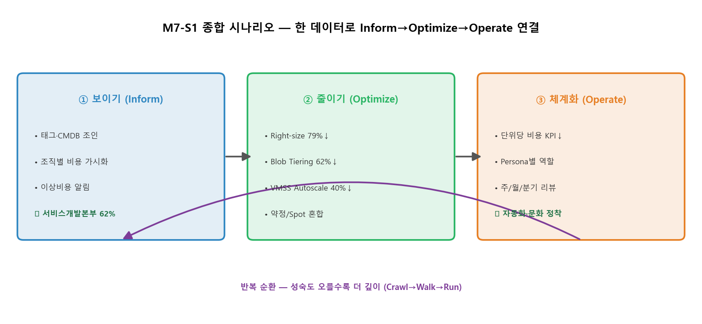

# M7-S1. 종합 실습 (실습, 15분)

> **모듈**: M7 종합실습 & 플러그인 데모 · **시간**: 16:25–16:40 (15분) · **유형**: 실습  
> **학습목표**: **Inform→Optimize→Operate 흐름을 한 시나리오로 연결**  
> **사용 Azure 서비스**: Cost Management(샘플 시나리오)  
> 📚 **참조**: 본 과정 M1~M6 전체 (FinOps 3단계 순환)

---

## 🎯 핵심 — 오늘 배운 걸 '한 바퀴' 돌린다

> 지금까지 단계별로 배운 보이기·줄이기·체계화를 **하나의 데이터/시나리오로 연결**합니다. *따로 노는 기능이 아니라 순환*임을 체감.

---

## 🗣 통합 시나리오 워크스루 (15분)

**시나리오**: "unicorn 구독 비용이 늘고 있다. 한 바퀴 돌려 진단·조치·정착하라."

### ① 보이기 (Inform) — 5분
1. **태그·CMDB 조인**(M2-S1·S5) → 조직별 비용: 서비스개발본부 **62%**, 데이터AI본부 35%, 미할당 2.4%
2. **비용 가시화**(M2-S2) → 서비스별: VM이 최대 비중
3. **이상비용**(M2-S3) → 예산 80% 알림 / 사용량 분리(M2-S4)
> *결과*: "누가·어디에·왜" 가 보인다. 미할당 2.4%는 태깅 보강 대상.

### ② 줄이기 (Optimize) — 5분
1. **Right-sizing**(M4-S1) → 과잉 VM B2ms로 **79%↓**
2. **Blob Tiering**(M4-S2) → 수명주기로 **62%↓**
3. **VMSS Autoscale**(M3) → 피크만 확장 **~40%↓**
4. **약정/Spot 혼합**(M4-S3·M5) → 상시 RI, 배치 Spot
> *결과*: 가시화로 찾은 비효율을 *구체적 조치*로. 합산 절감 기회 산출.

### ③ 체계화 (Operate) — 5분
1. **단위경제 KPI**(M6) → 단위당 비용 1.00→0.61원/건 (효율 개선)
2. **Persona별 역할** + **비용 리뷰 주기**(주/월/분기)
3. **자동화·문화** 정착 → *다음 순환은 더 깊이*(Crawl→Walk→Run)
> *결과*: 일회성이 아닌 *반복 가능한 운영*으로.

---

## 📋 수강생 체크리스트 (종합 평가 — 비중 0.2)
- [ ] 샘플 시나리오에서 **Inform**(조직/서비스별 가시화) 수행
- [ ] **Optimize**(최소 1개 절감 권고 + 절감액 추정)
- [ ] **Operate**(단위당 비용 KPI 1개 산출)
- [ ] 세 단계를 **하나의 흐름**으로 발표(1분)

## 💬 예상 Q&A
- **"어디부터 시작?"** → 항상 **보이기**. 안 보이면 줄일 수도 체계화할 수도 없음(드러커).
- **"한 번 돌리면 끝?"** → 순환. 성숙도 오를수록 같은 단계를 더 정교하게 재실행.
- **"가장 빠른 효과는?"** → 보통 미사용 제거 + Right-sizing(즉시), 약정은 중장기.

---

*작성: 종합 시나리오 다이어그램(`make_m7s1_chart.py`) · M1~M6 통합 · 다음 = M7-S2 플러그인 데모*
