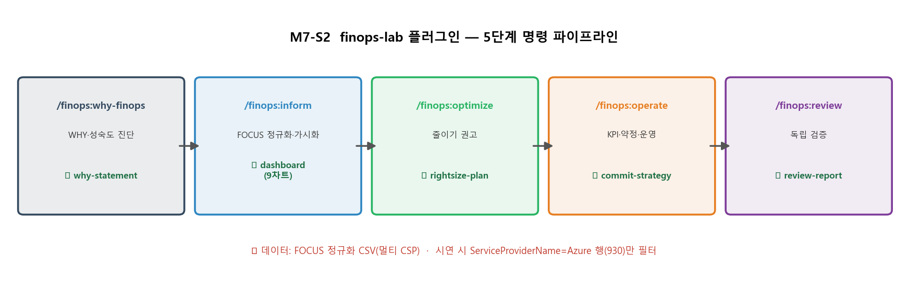

# M7-S2. FinOps 플러그인 데모 (실습·시연, 20분 · 마무리)

> **모듈**: M7 종합실습 & 플러그인 데모 · **시간**: 16:40–17:00 (20분) · **유형**: 실습(시연·따라하기)  
> **학습목표**: **finops-lab 플러그인**의 실제 명령 시퀀스 시연·따라하기 (Azure 행 필터 한정)  
> **사용**: finops-lab (`why-finops` / `inform` / `optimize` / `operate` / `review`)  
> 📚 오늘 배운 5단계를 **명령 한 줄씩**으로 자동화하는 도구 체험.  
> 📖 **1차 출처(FinOps Foundation)**: [FinOps Scopes](https://www.finops.org/framework/scopes/) ·
> [Technology Categories](https://www.finops.org/framework/technology-categories/) ·
> [Framework Overview](https://www.finops.org/framework/)

---

## 🎯 핵심 — 손으로 한 걸 도구로 '자동화'

> M1~M6에서 *손으로* 한 보이기·줄이기·체계화를, finops-lab 플러그인은 **`/finops:*` 명령 5개**로 자동 수행하고 **산출물(문서)을 생성**합니다.

---

## 🗣 5단계 명령 시퀀스 (따라하기, 18분)

| 순서 | 명령 | 하는 일 | 산출물 |
|---|---|---|---|
| 1 | **`/finops:why-finops`** | WHY 정의·성숙도 진단(Ownership×Capability) | **why-statement** |
| 2 | **`/finops:inform`** | FOCUS 정규화·태깅·이상탐지·대시보드 | **dashboard**(Chart.js 9차트) |
| 3 | **`/finops:optimize`** | 유휴·Right-sizing·약정·Spot 권고 | **rightsize-plan** |
| 4 | **`/finops:operate`** | 단위경제 KPI·약정 전략·운영 런북 | **commit-strategy** |
| 5 | **`/finops:review`** | 전 산출물 독립 검증 | **review-report** |

> 💡 또는 **`/finops:core`** 한 번으로 1~5단계 **풀 파이프라인** 자동 실행.  
> 📌 2~4단계(`inform`·`optimize`·`operate`)는 공식 **3 Phases**(**Inform** · **Optimize** · **Operate**)와 1:1 정렬됨.

### ⚠️ Azure 행 필터 (중요)
> 동봉 데이터 `out/focus-normalized.csv`는 **멀티 CSP**(AWS 784·**Azure 930**·GCP 424·Anthropic·OpenAI)입니다.
> (행 수는 교육용 자체 샘플 데이터 기준 · 공식 수치 아님) 본 과정은 Azure 특화이므로  
> **`ServiceProviderName = Microsoft Azure` 행만 필터**해 시연합니다. (오늘 M2-S4·S5에서 쓴 그 데이터)  
> 이 멀티 CSP + SaaS LLM 구성은 공식 **FinOps Scopes**(**FinOps for Public Cloud** · **FinOps for AI**)와
> **Technology Categories**(**FinOps for Public Cloud** · **FinOps for SaaS** · **FinOps for AI**)에 정렬됨.  
> 공식 정의상 FinOps Scope는 "기술 카테고리 전반에 걸친 정의된 지출 세그먼트로, 제품·코스트센터·환경 같은 비즈니스
> 구성요소에 정렬됨"이며, 두 Scope는 상호 배타적이지 않아 동일 사용이 동시에 포함될 수 있음.

### 시연 진행
1. 플러그인 설치 확인(`/finops:setup`) → 데이터 경로(`out/focus-normalized.csv`) 인식
2. `/finops:why-finops` 실행 → **why-statement** 생성 확인(M1에서 손으로 한 진단을 문서로)
3. `/finops:inform` → **dashboard**(HTML+Chart.js) 생성 → 브라우저로 열어 9개 차트 확인(M2)
4. `/finops:optimize` → **rightsize-plan**(절감 기회 목록)(M4·M5)
5. `/finops:operate` → **commit-strategy**(KPI·약정 시나리오)(M6)
6. `/finops:review` → **review-report**(정합성 검증)

---

## 📋 수강생 체크리스트
- [ ] 5단계 명령 **순서·산출물** 이해
- [ ] `dashboard` 산출물을 **브라우저로 열어** 확인
- [ ] **Azure 필터**의 이유 설명(멀티클라우드 데이터)
- [ ] "손으로 한 것 ↔ 명령 산출물" 매핑

## 💬 예상 Q&A
- **"매번 명령 5개?"** → `/finops:core`로 한 번에. 단계별 검토하려면 5개 분리 실행.
- **"우리 데이터로?"** → 본인 FOCUS Export(M2-S4) CSV를 같은 경로에 두면 동작.
- **"멀티클라우드도?"** → 예. 플러그인은 멀티 CSP 지원. 오늘은 Azure만 필터해 시연.
- **"산출물은 어디?"** → 프로젝트 산출물 폴더(why-statement·dashboard·rightsize-plan·commit-strategy·review-report).

---

## 🎓 과정 마무리 — 오늘 한 바퀴

> **WHY**(OpEx·낭비 1/3 — 교육용 자체 기준, 공식 수치 아님) → **COVERS 6원칙** → **보이기**(태그·가시화·이상·사용량·조인·자가진단) → **줄이기**(스케일링·Right-size·Tiering·Spot·약정) →  
> **체계화**(단위경제 KPI·Persona·리뷰) → **종합·자동화**.  
> 이제 여러분은 **이 순환을 스스로 한 바퀴 돌릴 수 있습니다.** Crawl에서 시작해 — *가장 비용 큰 부서부터, 비용 가시성부터, 3~6개월 안에.*  
> (Crawl은 공식 **Maturity Model** Crawl·Walk·Run의 시작 단계 — 모든 역량을 Run으로 끌어올리는 것이 목표가 아니라 환경에 맞는 적정 성숙도를 지향.)

---

*작성: finops-lab 플러그인 5단계 시연 가이드(`make_m7s2_chart.py`) · Azure 행 필터 · 과정 마무리 ·  
데이터 = `out/focus-normalized.csv`(Azure 930행)*  
*1차 출처 = FinOps Foundation [Scopes](https://www.finops.org/framework/scopes/) ·  
[Technology Categories](https://www.finops.org/framework/technology-categories/) ·  
[Framework Overview](https://www.finops.org/framework/) (CC BY 4.0)*
